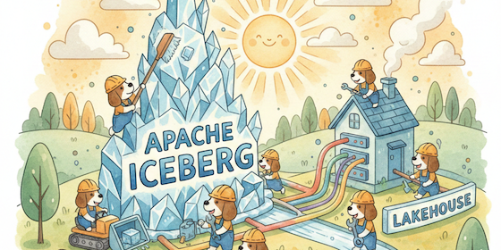
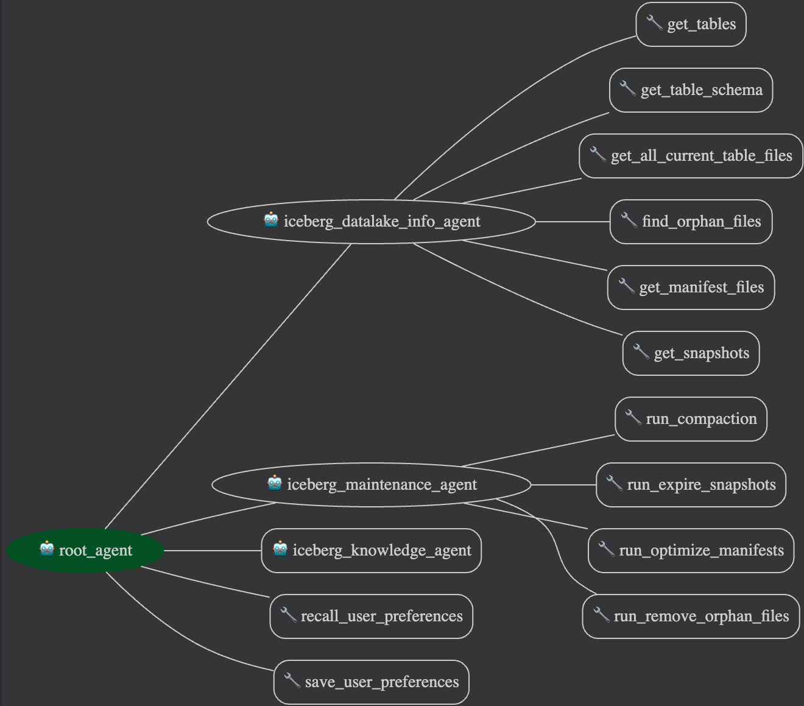

# Agent-Driven Optimization for Iceberg Data Lakehouses

This project introduces an automated, multi-agent system powered by Gemini 2.5 Flash to intelligently maintain and optimize Apache Iceberg data lakehouses through tasks like compaction, metadata management using best-practice guidance to reduce manual overhead and ensuring performance.



## Problem statement

Managing and optimizing Apache Iceberg data lakehouses can be complex due to the need for continuous maintenance tasks such as data compaction, metadata management, and schema evolution. This project aims to address these challenges by providing an automated, agent-driven solution for maintaining and optimizing Iceberg data lakes, reducing manual overhead and ensuring data integrity and performance.

The solution uses specialized agents that work together to:

- Examine table health and identify optimization opportunities
- Execute maintenance operations like compaction, snapshot expiration, and orphan file cleanup
- Provide expert knowledge on Iceberg best practices through integration with Apache Iceberg documentation
- Remember user preferences for personalized maintenance strategies

The agent-based approach enables intelligent, context-aware automation that adapts to the specific needs of each data lakehouse.

## Using agents to perform maintenance

This project leverages a multi-agent system to automate the maintenance and optimization of Apache Iceberg data lakehouses. The system consists of a `root_agent` that orchestrates several specialized sub-agents (below).This agent-based approach allows for intelligent automation, where tasks are dynamically identified and executed based on the current state and needs of the Iceberg data lakehouse.

**Root Agent (`root_agent`):**
- Orchestrates the overall workflow and coordinates between sub-agents
- Manages user preferences through persistent session storage
- Powered by Gemini 2.5 Flash with retry configuration for reliability

**Sub-Agents:**
- **`iceberg_datalake_info_agent`**: Gathers comprehensive information about the Iceberg database, including table schemas, data file statistics, and other relevant metadata.
    - Tools: `get_tables`, `get_table_schema`, `get_all_current_table_files`, `get_manifest_files`, `find_orphan_files`, `get_snapshots`
    - Analyzes current state of the data lakehouse
- **`iceberg_maintenance_agent`**: Executes various maintenance tasks such as data compaction, orphan file cleanup, and other optimization routines to ensure the data lakehouse remains efficient and performant.
    - Tools: `run_compaction`, `run_expire_snapshots`, `run_optimize_manifests`, `run_remove_orphan_files`
    - Executes optimization and cleanup tasks
    - Accesses user preferences for customized maintenance thresholds
- **`iceberg_knowledge_agent`**: Provides general knowledge and best practices related to Apache Iceberg, assisting in informed decision-making for maintenance and optimization strategies.
    - Powered by Gemini 2.5 Flash
    - Connected to Vertex AI Search with Apache Iceberg documentation datastore
    - Provides expert guidance on maintenance strategies. 

## Architecture



**Note**: All agents in this system are powered by **Gemini 2.5 Flash**, demonstrating effective use of Google's Gemini models for agentic workflows.

## Key Features Implemented

This project demonstrates the following key concepts from the course:

1. **Multi-Agent Orchestration**: Hierarchical agent system with a root agent coordinating three specialized sub-agents, each with distinct responsibilities and tools.

2. **Stateful Sessions**: Persistent user preferences stored in SQLite session storage, allowing the agent to remember user-specific configurations like schema names and maintenance thresholds across conversations.

3. **Tool Integration**: Custom tools for Iceberg operations (compaction, snapshot management, orphan file cleanup) and integration with Vertex AI Search for knowledge retrieval.

4. **Agent Specialization**: Sub-agents with `disallow_transfer_to_parent=True` for focused task execution without unnecessary context switching.

5. **Observability**: The project has logging and also metric collection and publishing. The metrics are published via Prometheus and can be viewed in a Grafana dashboard for monitoring agent performance and behavior.

6. **Model Configuration**: Retry logic and configurable model selection for production-ready reliability.

## Technologies Used

- **Google ADK (Agent Development Kit)**: Framework for building the multi-agent system
- **Gemini 2.5 Flash**: LLM powering all agents
- **Vertex AI Search**: Knowledge retrieval from Apache Iceberg documentation
- **SQLite**: Session persistence for stateful conversations
- **Apache Iceberg**: The data lakehouse technology
- **S3**: The object storage technology used for Apache Iceberg
- **Trino**: Query engine for executing Iceberg maintenance operations
- **Prometheus & Grafana**: Observability and metrics visualization
- **Docker**: Containerized local development environment

## Run Locally

To run locally, first you should make sure that you have an Apache Iceberg datalake. You can use the provided docker containers to bring one up.

### [Optional] Run a local Apache Iceberg datalake 

You can use the iceberg provided in `./iceberg-docker`

To start:
```bash
cd iceberg-docker
docker-compose up -d
```

To stop:
```bash
cd iceberg-docker
docker-compose stop -d --volumes
```

### Run the Multi-agent Iceberg Maintainer

#### Setting up the Python virtual environment
Before running any of the commands, create and activate the virtual environment:

To create the python virtual environment:
```shell
python -m venv .venv
source .venv/bin/activate
pip install -r requirements.txt
```


#### Running the agent
If you have already created the virtual environment, you can activate it using:
```shell
source .venv/bin/activate
```

Using adk web UI, specifying the sqlite database to persist the user preferences:

```shell
adk web --reload_agents --session_service_uri=sqlite:///iceberg_agent.db
```

Using adk command line:

```shell
adk run iceberg  --session_service_uri=sqlite:///iceberg_agent.db
```

Using the python main (and pre-defined interactions)

```shell
python -m iceberg.main
```


### Observability

#### Running the agent with tracing

By default we have INFO-level traces. To enable DEBUG-level traces:

```shell
adk web --reload_agents --session_service_uri=sqlite:///iceberg_agent.db --log_level DEBUG
```

#### Producing and displaying prometheus push metrics

By default if you run the Python's main module, it will produce Prometheus push metrics. To view them in Grafana, simply bring up the Grafana and Prometheus docker containers:

```shell
cd prometheus-docker
docker compose up -d
```

Then run `python -m iceberg.main` and observe the metrics in `http://localhost:3008`


