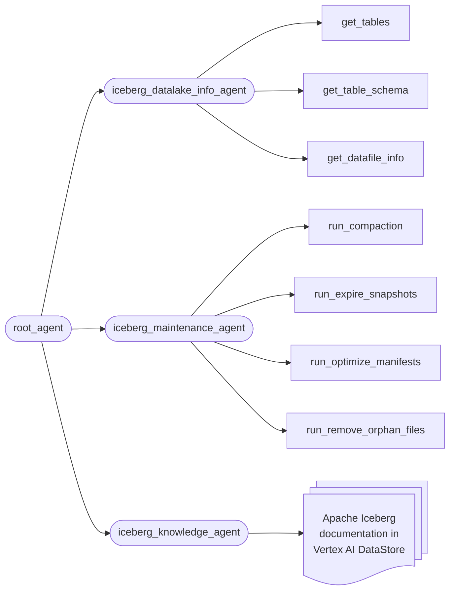

# Iceberg maintainer and optimizer 

## Problem statement

Managing and optimizing Apache Iceberg data lakehouses can be complex due to the need for continuous maintenance tasks such as data compaction, metadata management, and schema evolution. This project aims to address these challenges by providing an automated, agent-driven solution for maintaining and optimizing Iceberg data lakes, reducing manual overhead and ensuring data integrity and performance.

## Using agents to perform maintenance

This project leverages a multi-agent system to automate the maintenance and optimization of Apache Iceberg data lakehouses. The system consists of a `root_agent` that orchestrates several specialized sub-agents:

- **`iceberg_database_info_agent`**: Gathers comprehensive information about the Iceberg database, including table schemas, data file statistics, and other relevant metadata.
- **`iceberg_maintenance`**: Executes various maintenance tasks such as data compaction, orphan file cleanup, and other optimization routines to ensure the data lakehouse remains efficient and performant.
- **`iceberg_knowledge_agent`**: Provides general knowledge and best practices related to Apache Iceberg, assisting in informed decision-making for maintenance and optimization strategies.

This agent-based approach allows for intelligent automation, where tasks are dynamically identified and executed based on the current state and needs of the Iceberg data lakehouse.

## Architecture



## Run Locally

To run locally, first you should make sure that you have an Apache Iceberg datalake. You can use the provided docker containers to bring one up.

### [Optional] Run a local Apache Iceberg datalake 

You can use the iceberg provided in `./iceberg-docker`

To start:
```bash
cd iceberg-docker
docker-compose up -d
```

To stop:
```bash
cd iceberg-docker
docker-compose stop -d --volumes
```

### Run the Multi-agent Iceberg Maintainer

#### Setting up the Python virtual environment
Before running any of the commands, create and activate the virtual environment:

To create the python virtual environment:
```shell
python -m venv .venv
source .venv/bin/activate
pip install -r requirements.txt
```


#### Running the agent
If you have already created the virtual environment, you can activate it using:
```shell
source .venv/bin/activate
```

Using adk web UI:

```shell
adk web
```

Using adk command line:

```shell
adk run iceberg
```

Using the python main (and pre-defined interactions)

```shell
python -m iceberg.main
```